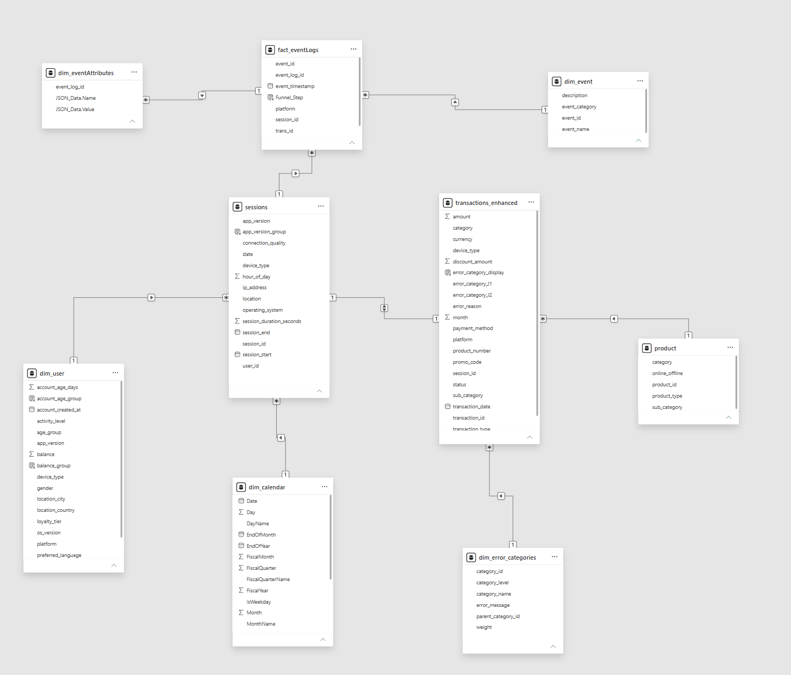
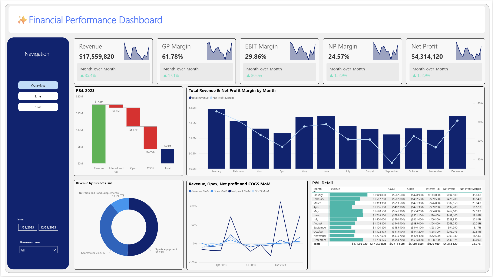
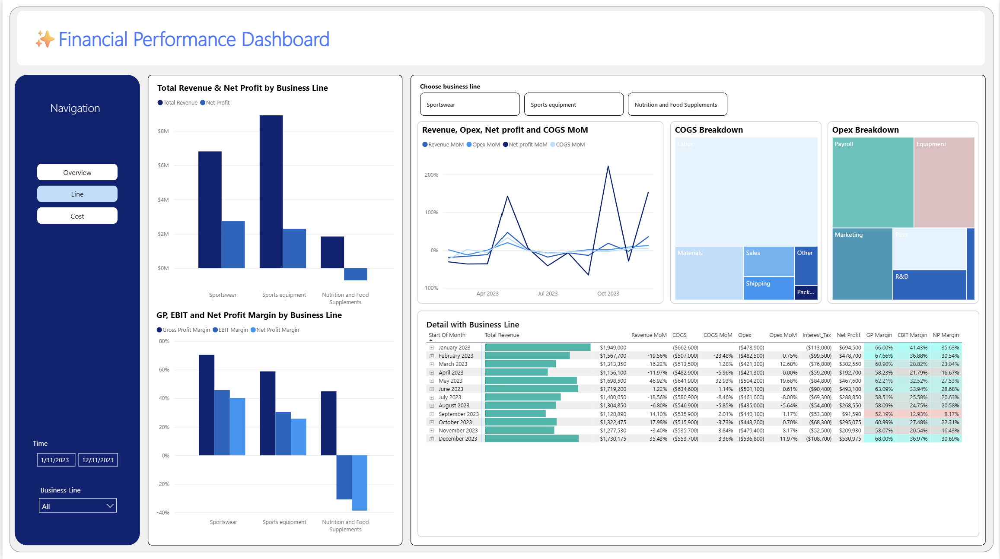
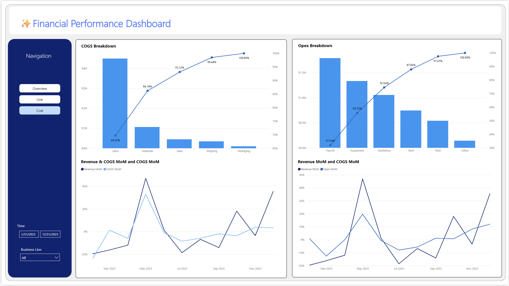

# 📊 Financial Analytics Dashboard — Multi-Line Sports & Wellness Co. (FY2023)

An interactive Power BI dashboard analyzing the full-year P&L of a multi-line sports & wellness company across three business units: **Sportswear**, **Sports Equipment**, and **Nutrition & Food Supplements**.

The dataset models **580 transactions in a star schema**, capturing revenue, COGS components, Opex categories, and monthly totals — enabling product-level and temporal profitability analysis across the fiscal year.

---

## 🎯 Business Background

The company operates three product lines under one P&L. Leadership needs visibility into:

- Which product line actually drives profit vs. just revenue
- What is eating into gross and net margin (COGS vs. Opex)
- Whether performance is seasonal or driven by a one-off event
- Where cost-structure levers exist to improve profitability

This dashboard was built to answer exactly those questions, structured across **3 pages**: Overview, Business Line, and Cost Breakdown.

---

## 🗂️ Data Model

---

## 📄 Dashboard Pages

### 1️⃣ Overview

KPI summary, full-year P&L waterfall, monthly revenue & margin trend, revenue split by business line, and full P&L detail table.

### 2️⃣ Business Line

Revenue and margin performance broken out per product line, with an interactive selector and COGS/Opex composition treemaps.

### 3️⃣ Cost Breakdown

Pareto analysis of COGS and Opex drivers, plus Revenue vs. Cost MoM correlation.

---

## 🔍 Key Insights

### 1. FY2023 headline performance
Full-year revenue closed at **$17,559,820**, with **Net Profit of $4,314,120** — a **24.57% net margin**. The P&L waterfall shows the drop from gross revenue to bottom line: Interest & Tax (**-$0.9M**), Opex (**-$5.6M**), and COGS (**-$6.7M**), in order of relative impact on the walk shown on the Overview page.

### 2. Revenue is heavily concentrated in two of three business lines
**Sports Equipment (50.7% of revenue)** and **Sportswear (38.8%)** together make up **~89.5%** of total revenue, leaving **Nutrition & Food Supplements at just 10.5%**. Any revenue shock in Sports Equipment has an outsized effect on total company performance — which is exactly what drives the September dip (see #4).

### 3. Nutrition & Food Supplements is the only structurally unprofitable line
This is the most consequential insight in the dataset. On the Business Line page:
- Sportswear: **~66% Gross Margin, ~40% Net Profit Margin** — the healthiest unit economics
- Sports Equipment: **~60% Gross Margin, ~26% Net Profit Margin** — highest revenue, solid profitability
- **Nutrition & Food Supplements: ~46% Gross Margin, but a NEGATIVE ~-30% Net Profit Margin**

Nutrition earns healthy gross margin at the product level, but Opex and Interest/Tax allocated to the line are large enough relative to its small revenue base to push it into a **net loss**. This line is generating revenue but **destroying value at the bottom line** — a classic case where a segment "looks fine" on gross margin but fails the full P&L test.

### 4. September is a single-month anomaly, not a seasonal pattern
Every trend chart on the Overview and Cost pages converges on September as the worst month of the year:
- **Net Profit Margin bottoms at 8.17%** — the only month in single digits, versus a 24.57% full-year average
- **EBIT Margin bottoms at 12.93%**, also the year's low
- **Revenue MoM contracts -14.10%**, the steepest monthly drop in the dataset
- Net Profit falls to **$91,590** — roughly one-fifth of the average month

Critically, the recovery is immediate: October rebounds to 22.31% NP margin and December closes the year at 30.69%, the second-best month after February. This pattern — a sharp single-month drop followed by full recovery — points to a **one-off event** (e.g., a large Opex charge, a demand shock, or a pricing/promotional issue) rather than a recurring seasonal trend. This should be the first data point flagged to leadership, since it's actionable and time-bound rather than structural.

### 5. Labor and Payroll are the dominant, and most stable, cost levers
The Cost Breakdown Pareto charts show extreme concentration at the top of both cost stacks:
- **Labor alone is 69.67% of total COGS** — more than 2x every other COGS category combined
- **Payroll alone is 31.94% of total Opex**, with Payroll + Equipment + Marketing reaching **74.54%** of Opex (the practical 80/20 cutoff)

This means cost-control initiatives aimed at Materials, Shipping, Packaging, Rent, R&D, or "Other" — while easy to target individually — will have limited effect on the total cost base. Labor efficiency and payroll structure are the two levers that actually move company-wide margin.

### 6. Revenue and cost move together, but with amplified swings in cost
On the Cost page, Revenue MoM and COGS MoM track each other closely in direction (both spike around May, both dip mid-year) — expected, since COGS scales with volume. But the **COGS MoM line consistently overshoots Revenue MoM at the peaks** (e.g., the May spike), suggesting cost scales slightly faster than revenue during high-volume months — a sign of potential inefficiency in variable cost management (e.g., overtime labor, rush shipping) rather than a fixed-cost issue.

### 7. February, not January, is the true margin peak
While January has the highest absolute revenue ($1.95M) and net profit ($694.5K) of the year, **February actually posts the highest Gross Profit Margin (67.66%) and EBIT Margin (36.88%)** of any month — narrowly ahead of December. Revenue and margin peak in different months, which matters for how the business plans pricing, promotions, and cost timing — chasing the highest-revenue month is not the same as chasing the highest-margin month.

---

## 💡 Recommendations

1. **Investigate the September event directly.** Pull the underlying transaction-level detail for September specifically — this single month accounts for a disproportionate share of the annual margin volatility and is the highest-leverage item to explain.
2. **Reassess the Nutrition & Food Supplements cost allocation and pricing.** A line with positive gross margin but negative net margin needs either a repricing strategy, an Opex allocation review, or a scale decision (invest to grow past the fixed-cost breakeven, or right-size the cost base).
3. **Target Labor and Payroll efficiency first.** Because these two categories represent the large majority of COGS and Opex respectively, even a small percentage improvement here outweighs optimization efforts across all remaining cost categories combined.
4. **Monitor COGS-to-Revenue elasticity in peak months.** The overshoot in COGS MoM during revenue spikes (e.g., May) is worth a root-cause review before the next high-volume period, to catch inefficiency before it recurs.

---

## 🛠️ Tools Used
- **Power BI** — data modeling (star schema), DAX measures, and dashboard design
- **DAX** — Month-over-Month calculations, Gross/EBIT/Net Profit Margin measures, Pareto (cumulative %) logic for COGS/Opex breakdowns

